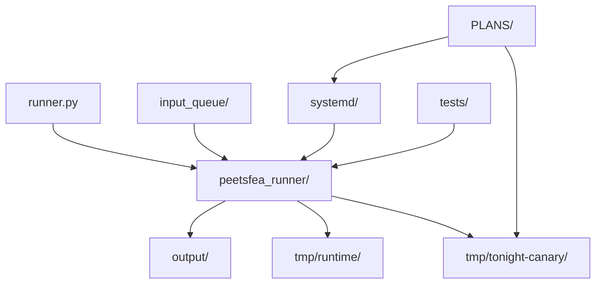
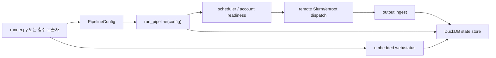
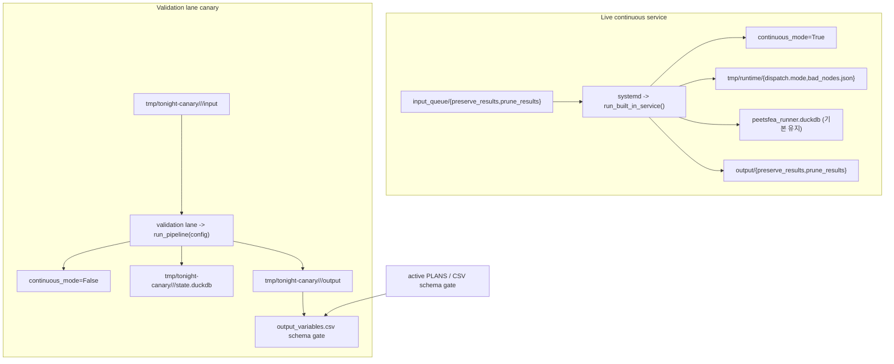

# Current Project Overview

이 문서는 현재 구현된 `peetsfea-runner`의 구조와 운영 경계를 설명하는 참조 문서다. active 실행 기준과 canary gate는 계속 `PLANS/`가 우선이며, 여기서는 그 기준이 코드에 어떻게 반영되는지만 요약한다.

## 1. 저장소/모듈 구조

아래 구조는 현재 저장소에서 아키텍처 이해에 필요한 핵심 경로만 추린 것이다.

- `runner.py`는 `PipelineConfig`를 조립한 뒤 `run_pipeline(config)`를 호출하는 함수 기반 진입 래퍼다.
- `peetsfea_runner/`는 scheduler, remote Slurm/enroot dispatch, DuckDB state store, web/status, validation lane 로직을 담는 핵심 패키지다.
- `tmp/runtime/`는 `dispatch.mode`, `bad_nodes.json` 같은 운영 제어 파일 경로다.
- `tmp/tonight-canary/`는 validation lane 전용 입력, 출력, 별도 DB를 두는 canary 경로다.
- `PLANS/`는 구조 설명 문서가 아니라 운영 기준 문서다.

## 2. 함수 호출 기반 런타임 경로

현재 파이프라인은 CLI 서브커맨드가 아니라 `run_pipeline(config)` 단일 경로를 기준으로 동작한다.

- `runner.py`는 환경 변수를 읽어 `PipelineConfig`를 만들고 `run_pipeline(config)`를 호출한다.
- continuous user service는 [systemd/peetsfea-runner.service](../../systemd/peetsfea-runner.service)에서 `run_built_in_service()`를 실행하고, 그 내부에서 lane별 `PipelineConfig`를 만들어 worker loop를 유지한다.
- `scheduler` 단계는 account readiness, capacity, slot worker 분배를 담당한다.
- `remote Slurm/enroot dispatch` 단계는 원격 sbatch 실행, worker bootstrap, 결과 수집을 처리한다.
- `output ingest` 이후 상태와 이벤트는 DuckDB state store에 기록되고, embedded web/status가 같은 상태를 읽어 운영 화면을 제공한다.

## 3. continuous service와 validation lane 경계

active `PLANS/` 기준으로 live service와 canary는 입력, 출력, DB, `continuous_mode`가 분리되어야 한다.

- live continuous service는 `input_queue` 아래 lane만 사용하고, loose `.aedt`를 루트에 두지 않는다.
- canary는 `tmp/tonight-canary/<window>/<lane>` 아래 별도 입력/출력/DB를 사용하므로 live service 산출물과 섞지 않는다.
- canary는 service 재기동이 아니라 validation lane의 `run_pipeline(config)` 함수 호출 경로에서 수행한다.
- live DB 기본 정책은 유지이며, canary는 별도 `state.duckdb`를 사용한다.
- canary green 판정은 `output_variables.csv` 존재만이 아니라 active `PLANS/`의 CSV schema gate 기준을 따라야 한다.
- `dispatch.mode`와 `bad_nodes`는 live continuous service 제어 경계에 속한다.
